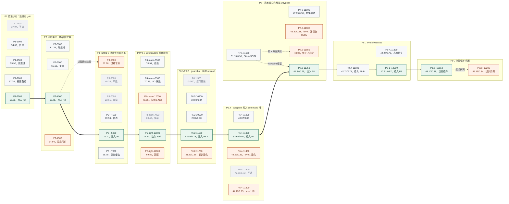
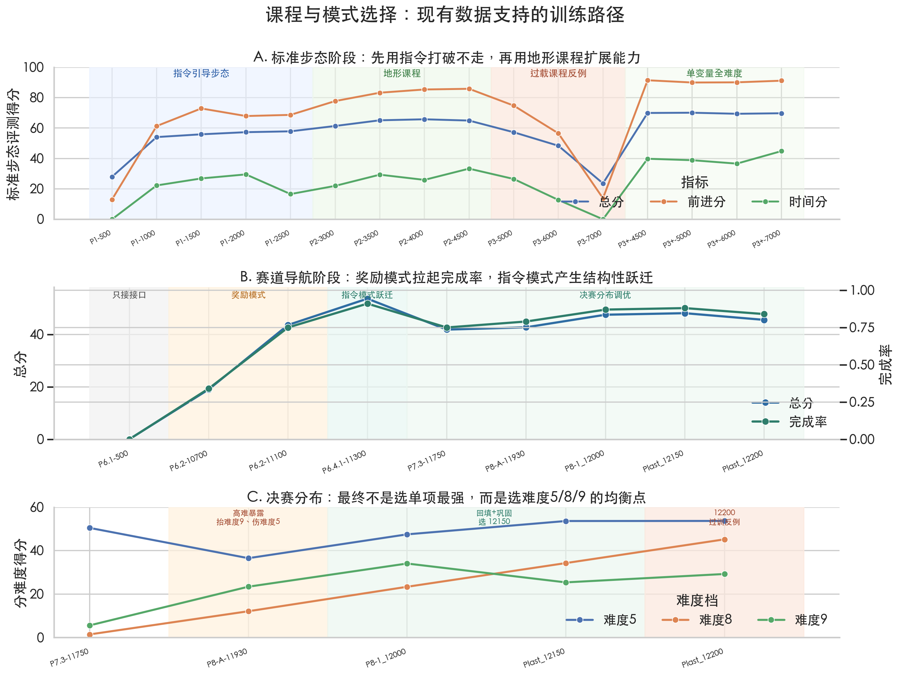
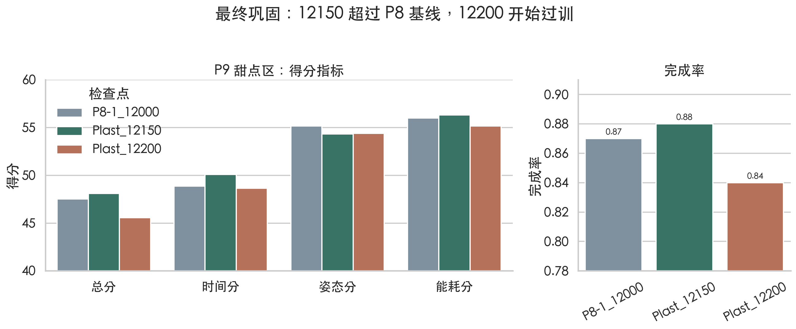
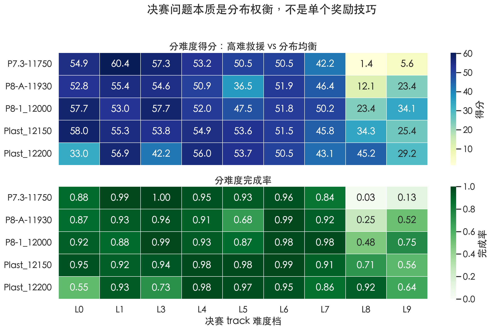
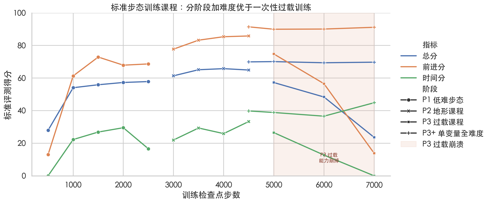
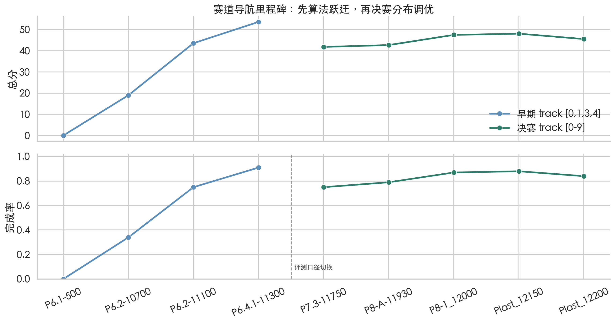

# kaiwu-JLU-QuadrupedTrackNav

腾讯开悟四足机器人自主导航与运控比赛决赛阶段方案整理。

本仓库记录的是从 standard locomotion 迁移到 track navigation 的完整实验路径。当前主线不再是单地形行走，而是在决赛 track setting 下，让四足机器人连续通过坡、反坡、台阶、反台阶和迷宫入口，并在 `[0, 1, 3, 4, 5, 6, 7, 8, 9]` 难度档上取得稳定分数。

## 当前结论

当前主候选是 **`Plast_12150`**。

在决赛全口径 50 局压力测下：

| 检查点 | 总分 | 完成率 | 时间分 | 姿态分 | 能耗分 |
| --- | ---: | ---: | ---: | ---: | ---: |
| `P8-1_12000` | 47.51 | 0.87 | 48.87 | 55.16 | 56.00 |
| **`Plast_12150`（当前选择）** | **48.10** | **0.88** | **50.09** | 54.31 | **56.32** |
| `Plast_12200`（过训反例） | 45.55 | 0.84 | 48.63 | 54.37 | 55.15 |

**`Plast_12150` 的主要收益是中高难稳定性更均衡**：level5 从 `47.50 / 0.87` 提到 `53.64 / 0.98`，level8 从 `23.36 / 0.48` 提到 `34.27 / 0.71`。代价是 level9 从 `34.07 / 0.75` 回落到 `25.39 / 0.56`，但 overall、completion 和 level5/8 的综合表现更好，因此当前优先保护 **`Plast_12150`**。

`Plast_12200` **不作为主候选**。它的 level8 更强，但 low/mid level 开始被洗掉，overall 和 completion 都回落。它在故事里更适合作为“继续长训会过训”的反例。

## 现有图表

这些图全部由 `scripts/plot_experiment_figures.py` 从 `EXPERIMENTS.md` 中已经沉淀的关键数值整理而来。它们的作用不是替代完整实验记录，而是先把当前实验路径可视化出来。

### 本地故事稿

当前有一个可直接打开的分页 HTML 原型：[story/index.html](story/index.html)。它按“可迁移步态 → 可控导航接口 → 决赛分布巩固”的骨架组织，每个 `<section>` 对应一页后续可迁移到 PPT 的内容。

### Checkpoint 选择树

这棵树只回答一个问题：每个阶段扫了多个 checkpoint 之后，最后选谁作为下一阶段起点。绿色节点是被继承的主线，橙色节点是局部更强但不适合继续继承的反例，灰色节点是评测后淘汰的点。





这张图是主线图：上半段说明标准步态阶段为什么要分“指令引导步态、地形课程、过载课程反例、单变量全难度”几步走；中间说明赛道阶段不是单靠 reward，而是先用导航 reward 拉起完成率，再用 command 槽导航产生结构性跃迁；下半段说明最终选择 **`Plast_12150`**，不是因为它单项最强，而是因为它在难度5/8/9 之间最均衡。



这张图说明为什么当前保护 **`Plast_12150`**：它相对 P8 基线提高总分和完成率，而 `Plast_12200` 虽然局部能力更强，但整体已经回落。



这张图是当前最重要的分布证据。P8-A 打开 level8/9 但牺牲 level5，P8-B 修回中高难，**P9-12150 更均衡**，P9-12200 则开始洗掉 low/mid level。



这张图展示 standard locomotion 阶段的课程学习逻辑：先学稳定 gait，再逐步加地形；一次性叠全难度、maze、push 和更强 reward 会导致 P3 崩掉。



这张图展示 track 阶段的两次跃迁：P6.4 的 command 槽导航带来算法级跃迁，P8/P9 则是在决赛全口径下做分布调优。

## 决赛评测口径

```toml
[env]
num_envs = 1024
episode_length_s = 120.0

[terrain]
mode = "track"
level = [0, 1, 3, 4, 5, 6, 7, 8, 9]

[terrain.track]
track_length = 5
sub_terrains = ["pyramid_slope", "pyramid_slope_inv", "pyramid_stairs", "pyramid_stairs_inv", "open_entry_maze"]

[commands.limit]
lin_vel_x = [0.0, 0.8]
lin_vel_y = [-0.3, 0.3]
ang_vel_z = [-1.5, 1.5]
```

这个口径和早期 standard locomotion 评测不能直接横比。P7 之前的高分主要说明 gait 和中等难度地形能力；P8/P9 之后才真正对齐决赛 track 分布。

## 核心设计

最终方案不是单纯堆 reward，而是把导航和运动控制拆开。

`agent_ppo/` 是当前决赛主线代码。我们保留 PPO locomotion policy 的基础能力，同时给 track navigation 增加紧凑目标信息：

| 观测 | 原始维度 | 决赛 track-nav 维度 | 说明 |
| --- | ---: | ---: | --- |
| policy obs | 301 | 305 | `proprio(45) + scan(256) + goal(4)` |
| critic obs | 316 | 320 | `critic_proprio(60) + scan(256) + goal(4)` |

新增 4 维 goal obs 来自 `agent_ppo/feature/goal_observation.py`，表示目标在机器人坐标系下的相对位置、距离和航向误差。旧 standard checkpoint 通过 partial checkpoint loading 兼容：重叠权重正常加载，新增输入列从零初始化。

更关键的是 P6.4 之后的接口变化：我们没有只把 waypoint append 到 obs 末尾，等旧 policy 自己学会使用新特征，而是把启发式 waypoint 转成 `[vx, vy, wz]`，写回 policy 已经熟悉的 command 槽 `obs[:, 6:9]`。这样规则层负责给导航方向，PPO policy 继续负责四足运动、姿态和能耗。

这条路线的意义是：路径选择和局部避障属于高层结构约束，不适合完全交给稀疏/错位 reward 逼 PPO 自学；复杂地形上的稳定 gait、姿态和能耗 trade-off 才是 PPO 的主要学习空间。

## 实验主线

### 1. Standard locomotion 预训练

早期 C0-P1 到 P5 主要解决“会不会稳定走”的问题。关键发现是 command 分布、课程学习和 terrain sampling 比单个 reward trick 更重要。

这一阶段的目标不是决赛导航，而是得到可迁移的 gait。后续 track 阶段能 work，很大程度上依赖 standard locomotion checkpoint 提供的基础运动能力。

### 2. P6: 从 locomotion 迁移到 track navigation

P6.1 首次把 policy/critic obs 扩到 `305/320`，并通过 partial checkpoint loading 从 standard checkpoint 启动。接口能跑通，但正式 eval 几乎不完成，说明“能走”不等于“能导航”。

P6.2 加入 `approach_goal`、`heuristic_navigation`、`deadend_escape`、`wall_proximity_brake` 等导航 reward 后，completion 从接近 0 提到约 0.7。这一步证明 reward shaping 是必要的，但还不足以解决路径选择。

P6.4 开始把 waypoint-derived navigation command 写回 `obs[6:9]`。这一步让规则导航和 PPO locomotion 解耦，成为后续所有强 checkpoint 的基础。

### 3. P7: 修局部 waypoint 和中高难

P7 针对 replay 中的具体问题修正局部 waypoint：迷宫分叉时减少绕远路，坡/台阶上减少斜着走。P7.3-11750 一度成为主候选，在 level0-7 上表现可用，但决赛全口径暴露出 level8/9 几乎不行。

P7.3-11750 决赛全口径 20 局：

| 指标 | 数值 |
| --- | ---: |
| overall | 41.84 |
| completion | 0.75 |
| level8 | 1.43 / 0.03 |
| level9 | 5.59 / 0.13 |

### 4. P8: level8/9 rescue

P8-A 从 P7.3-11750 出发，把训练难度推高到 `[0.55, 1.0]`，目标是打开 level8/9。结果确认高难 exposure 有效，但牺牲 level5。

P8-B 从 P8-A 回填中高难，使用 `difficulty_range=[0.35, 1.0]`。这一步修复 level5/7，同时保留 level8/9 增益。P8-1_12000 成为比 P7.3 更强的候选。

P8-1_12000 40 局压力测：

| 难度档 | 得分 / 完成率 |
| --- | ---: |
| overall | 47.51 / 0.87 |
| level5 | 47.50 / 0.87 |
| level8 | 23.36 / 0.48 |
| level9 | 34.07 / 0.75 |

### 5. P9: final mix consolidation

P9 从 P8-1_12000 出发，用低学习率 `5e-5` 在全量难度 `[0.0, 1.0]` 上做 conservative consolidation。目标不是继续探索，而是提高全局稳定性，同时尽量保护 P8 打开的 level8/9。

**P9-12150 成为当前 SOTA，也是当前提交候选。** 继续到 12200 后，level8 虽然更好，但 low/mid level 开始回落，说明 12150 附近是甜点区，不应继续无脑长训。

## 当前不变量

后续如果继续尝试，只做 `12150` 邻域短扫，例如：

```text
12130 / 12140 / 12160 / 12170
```

成功标准必须同时满足：

- overall 超过 `48.10`；
- completion 不低于 `0.88`；
- level8 不低于 `34.27 / 0.71`；
- level9 不继续明显掉；
- level5 不低于 53 左右。

如果时间紧，直接以 **`Plast_12150`** 作为提交候选。

## 仓库结构

```text
agent_ppo/
  agent.py                              # ActorCritic 初始化、partial checkpoint loading
  conf/conf.py                          # StageConfig / TrackNavConfig
  conf/train_env_conf_track_nav.toml    # 当前 P9 track-nav 训练配置
  feature/goal_observation.py           # goal obs、local waypoint、nav command
  feature/policy_observation_process.py # policy obs 拼接与 command 槽写回
  feature/critic_observation_process.py # critic obs 拼接与 command 槽写回
  feature/reward_process.py             # 导航 reward 与 command tracking reward
  workflow/train_workflow.py            # PPO workflow 与导航诊断监控

conf/
  configure_app.toml                    # 平台训练入口配置，含 checkpoint 保存间隔

tests/
  test_p6_goal_obs_static.py            # 静态检查：obs 维度、partial load、导航 reward、监控项

EXPERIMENTS.md                          # 完整实验记录和分 checkpoint 判断
```

当前 README 和实验结论均以 `agent_ppo/` 为准。

## 答辩故事线

我们不是靠单个 reward hack 得到最终结果，而是按阶段排除问题：

1. 先把 standard locomotion 训稳，得到可迁移 gait。
2. 切到 track 后发现 reward 与平台 score 脱钩，训练 reward 高不代表 completion 高。
3. 追加 goal obs，并用 partial checkpoint loading 保留旧 locomotion 能力。
4. 发现仅追加 obs 接口太弱，于是 P6.4 把启发式 waypoint 写入 command 槽，让规则导航和 PPO locomotion 解耦。
5. 决赛全口径暴露 level8/9 是最大短板，于是 P8-A 做高难 exposure。
6. 高难 exposure 打开 level8/9，但牺牲 level5，于是 P8-B 用中高难回填。
7. 最后 P9 用低学习率全量 consolidation，得到当前主候选 **`Plast_12150`**。

整个过程中，每次只改一个主要变量，用 checkpoint sweep 和正式 eval/压力测做判断。训练 reward 曲线只用于诊断，最终选择以平台 eval 的 overall、completion 和分 level 结果为准。

## 验证

当前仓库包含轻量静态测试：

```bash
python -m unittest tests/test_p6_goal_obs_static.py
```

该测试检查 track-nav 关键接口是否仍然存在，包括 `305/320` obs 维度、partial checkpoint loading、goal obs 拼接、command 槽写回、导航 reward 和监控项。

完整训练和评测依赖腾讯开悟比赛平台环境，本仓库主要用于方案整理、代码追踪和答辩复盘。
